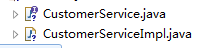

# CRM_SSM练习
**关键字** 

需要改进:需要优化jar部分

需要改进传入出值为查询对应的类别部分运用配置文件传入
***
## 1 搭建初始环境
### 1.1 新建web项目

### 1.2 引入前端文件

### 1.3 引入jar包

### 1.4 配置web.xml配置文件

```xml
 <!-- 加载spring容器 -->
	<context-param>
		<param-name>contextConfigLocation</param-name>
		<param-value>classpath:ApplicationContext-*.xml</param-value>
	</context-param>
	<listener>
		<listener-class>org.springframework.web.context.ContextLoaderListener</listener-class>
	</listener>
  
  
  <!-- springmvc前端控制器 -->
  <servlet>
  	<servlet-name>springMvc</servlet-name>
  	<servlet-class>org.springframework.web.servlet.DispatcherServlet</servlet-class>
  	<init-param>
  		<param-name>contextConfigLocation</param-name>
  		<param-value>classpath:SpringMvc.xml</param-value>
  	</init-param>
  	<!-- 在tomcat启动的时候就加载这个servlet -->
  	<load-on-startup>1</load-on-startup>
  </servlet>
  <servlet-mapping>
  	<servlet-name>springMvc</servlet-name>
  	<!-- 
  	*.action    代表拦截后缀名为.action结尾的
  	/ 			拦截所有但是不包括.jsp
  	/* 			拦截所有包括.jsp
  	 -->
  	<url-pattern>*.action</url-pattern>
  </servlet-mapping>
  
  <!-- 配置Post请求乱码 -->
  <filter>
		<filter-name>CharacterEncodingFilter</filter-name>
		<filter-class>org.springframework.web.filter.CharacterEncodingFilter</filter-class>
		<init-param>
			<param-name>encoding</param-name>
			<param-value>utf-8</param-value>
		</init-param>
	</filter>
	<filter-mapping>
		<filter-name>CharacterEncodingFilter</filter-name>
		<url-pattern>/*</url-pattern>
	</filter-mapping>
```

### 1.5 建立web(controller)层

**Controller包和引入SpringMVC的xml配置文件**
- com.公司名.controller
- 新建SpringMvc.xml
```xml
 
    <!-- 引入字典资源文件 -->
    <context:property-placeholder location="classpath:resource.properties"/>
    
    <!-- @Controller注解扫描 -->
    <context:component-scan base-package="cn.itheima.controller"></context:component-scan>
    
    <!-- 注解驱动:
    		替我们显示的配置了最新版的注解的处理器映射器和处理器适配器 -->
    <mvc:annotation-driven conversion-service="conversionService"></mvc:annotation-driven>
    
    <!-- 配置视图解析器 
	作用:在controller中指定页面路径的时候就不用写页面的完整路径名称了,可以直接写页面去掉扩展名的名称
	-->
	<bean class="org.springframework.web.servlet.view.InternalResourceViewResolver">
		<!-- 真正的页面路径 =  前缀 + 去掉后缀名的页面名称 + 后缀 -->
		<!-- 前缀 -->
		<property name="prefix" value="/WEB-INF/jsp/"></property>
		<!-- 后缀 -->
		<property name="suffix" value=".jsp"></property>
	</bean>
	
	<!-- 配置自定义转换器 
	注意: 一定要将自定义的转换器配置到注解驱动上
	-->
	<bean id="conversionService"
		class="org.springframework.format.support.FormattingConversionServiceFactoryBean">
		<property name="converters">
			<set>
				<!-- 指定自定义转换器的全路径名称 -->
				<bean class="cn.itheima.controller.converter.CustomGlobalStrToDateConverter"/>
			</set>
		</property>
	</bean>
```
**注意事项**
1. web.xml内springmvc前端控制器
```xml
<servlet>
  	<servlet-name>springMvc</servlet-name>
  	<servlet-class>org.springframework.web.servlet.DispatcherServlet</servlet-class>
  	<init-param>
  		<param-name>contextConfigLocation</param-name>
  		<param-value>classpath:SpringMvc.xml</param-value>
  	</init-param>
```
2. 配置文件名称是在web.xml文件里面设置
```web.xml片段
<servlet-mapping>
  	<servlet-name>springMvc</servlet-name>
  	<!-- 
  	*.action    代表拦截后缀名为.action结尾的
  	/ 			拦截所有但是不包括.jsp
  	/* 			拦截所有包括.jsp
  	 -->
  	<url-pattern>*.action</url-pattern>
  </servlet-mapping>
```
3. SpringMvc.xml配置converters配置自定义转换器 (此功能是拦截时间格式的转换)
```xml
<bean id="conversionService"
		class="org.springframework.format.support.FormattingConversionServiceFactoryBean">
		<property name="converters">
			<set>
				<!-- 指定自定义转换器的全路径名称 -->
				<bean class="com.dj.controller.converter.CustomGlobalStrToDateConverter"/>
			</set>
		</property>
	</bean>
```
### 1.6 建立service层
**建立service层包,引入service层配置文件,引入事物配置文件**
- com.公司名.controller
- ApplicationContext-service.xml(加入service注解扫描)
```ApplicationContext-service.xml
	<!-- @Service扫描 -->
	<context:component-scan base-package="cn.itheima.service"></context:component-scan>
```
- ApplicationContext-trans.xml(加入事物)
```xml
<!-- 事务管理器 -->
	<bean id="transactionManager"
		class="org.springframework.jdbc.datasource.DataSourceTransactionManager">
		<!-- 数据源 -->
		<property name="dataSource" ref="dataSource" />
	</bean>
	
	<!-- 通知 -->
	<tx:advice id="txAdvice" transaction-manager="transactionManager">
		<tx:attributes>
			<!-- 传播行为 -->
			<tx:method name="save*" propagation="REQUIRED" />
			<tx:method name="insert*" propagation="REQUIRED" />
			<tx:method name="delete*" propagation="REQUIRED" />
			<tx:method name="update*" propagation="REQUIRED" />
			<tx:method name="find*" propagation="SUPPORTS" read-only="true" />
			<tx:method name="get*" propagation="SUPPORTS" read-only="true" />
		</tx:attributes>
	</tx:advice>
	
	<!-- 切面 -->
	<aop:config>
		<aop:advisor advice-ref="txAdvice"
			pointcut="execution(* cn.itheima.service.*.*(..))" />
	</aop:config>
```
**注意事项**:注意修改`pointcut="execution(* cn.itheima.service.*.*(..))"`此处包名
### 1.7 建立dao层
- 新建到层对应包结构
`com.公司名.dao`
- 配置ApplicationContext-dao.xml文件
```xml
<!-- 加载配置文件 -->
	<context:property-placeholder location="classpath:db.properties" />
	<!-- 数据库连接池 -->
	<bean id="dataSource" class="com.alibaba.druid.pool.DruidDataSource"
		destroy-method="close">
		<property name="driverClassName" value="${jdbc.driver}" />
		<property name="url" value="${jdbc.url}" />
		<property name="username" value="${jdbc.username}" />
		<property name="password" value="${jdbc.password}" />
		<property name="maxActive" value="10" />
		<property name="maxIdle" value="5" />
	</bean>
	
	<!-- mapper配置 -->
	<!-- 让spring管理sqlsessionfactory 使用mybatis和spring整合包中的 -->
	<bean id="sqlSessionFactory" class="org.mybatis.spring.SqlSessionFactoryBean">
		<!-- 数据库连接池 -->
		<property name="dataSource" ref="dataSource" />
		<!-- 加载mybatis的全局配置文件 -->
		<property name="configLocation" value="classpath:SqlMapConfig.xml" />
	</bean>

	
	<!-- 配置Mapper扫描器 -->
	<bean class="org.mybatis.spring.mapper.MapperScannerConfigurer">
		<property name="basePackage" value="cn.itheima.dao"/>
	</bean>
```

**注意事项**:
- 注意配置ApplicationContext-dao.xml中加载mybatis的全局配置文件SqlMapConfig.xml
`<property name="configLocation" value="classpath:SqlMapConfig.xml" />`
SqlMapConfig.xml可以通过逆向工程生成
```xml
<configuration>
	
</configuration>
```
- 注意配置ApplicationContext-dao.xm配置Mapper扫描器value值
```xml
<bean class="org.mybatis.spring.mapper.MapperScannerConfigurer">
		<property name="basePackage" value="cn.itheima.dao"/>
	</bean>
 ```
### 1.8 数据库层
- 新建数据库对应pojo包


- 引入对应包的pojo对象

- 数据库内新建对应pojo表
- 配置db.properties
(1) 在`ApplicationContext-dao.xml`加载配置文件

```xml
	<context:property-placeholder location="classpath:db.properties" />
```

(2) db.properties文件

```properties
	jdbc.driver=com.mysql.jdbc.Driver
	jdbc.url=jdbc:mysql://localhost:3306/crm001?characterEncoding=utf-8
	jdbc.username=root
	jdbc.password=root
```

**注意事项**

- 注意配置数据库名称


## 2 业务功能实现

### 2.1 查询条件初始化

#### 2.1.1 启动项目展示customer.jsp页面

- controller层写入代码找到地址栏进入方法

用 `@RequestMapping("/方法名称")` 跳转至方法内部,通过return返回jsp页面

```java
@Controller
@RequestMapping("/customer")
public class CustomerController {
	@RequestMapping("/list")
	public String list()  throws Exception{
		return "customer";
	}
}
```
**注意** 在springmvc.xml文件中配置return返回jsp文件的后缀
```xml
<!-- 配置视图解析器 
	作用:在controller中指定页面路径的时候就不用写页面的完整路径名称了,可以直接写页面去掉扩展名的名称
	-->
	<bean class="org.springframework.web.servlet.view.InternalResourceViewResolver">
		<!-- 真正的页面路径 =  前缀 + 去掉后缀名的页面名称 + 后缀 -->
		<!-- 前缀 -->
		<property name="prefix" value="/WEB-INF/jsp/"></property>
		<!-- 后缀 -->
		<property name="suffix" value=".jsp"></property>
	</bean>
```

#### 2.1.2 将下来菜单内的数据从数据库内回写值页面上 

**需求:** 
**通过给一个指定的编码查询出对应的客户来源,所属行业,客户级别**
(1) 将`客户来源` `所属行业` `客户级别`的下来菜单从数据库内拿出来

(2) 然后回写至jsp页面上


**思路:**

通过给查询数据库,了解客户来源,所属行业,客户级别对应的编码

把编码传值service层,service传至到层的xml文件内通过xml文件内的sql语句对数据查询返回一个list,对象为一个Polo的`BaseDict`类对象.

代码编写从dao层开始编写

##### 2.1.2.1 dao层

**(1) 先在xml文件内书写查询语句**


- 写完后将要返回的数据类型写在`resultType`后`resultType="com.dj.pojo.BaseDict"`

- 将要穿入的数据类型写在`parameterType`内`parameterType="string"`

- 在`<mapper></mapper>`内的`namespace`中将xml文件和到层java接口文件对应
	```xml
	<?xml version="1.0" encoding="UTF-8" ?>
	<!DOCTYPE mapper PUBLIC "-//mybatis.org//DTD Mapper 3.0//EN" "http://mybatis.org/dtd/mybatis-3-mapper.dtd" >
	<mapper namespace="com.dj.dao.DictMapper">
	<select id="findDictCode" parameterType="string" resultType="com.dj.pojo.BaseDict">
			select * from base_dict a WHERE a.dict_enable=1 and a.dict_type_code=#{code}  ORDER BY a.dict_sort
		</select>
	</mapper>
	```
**(2) 对应的dao层的接口文件`DictMapper.java`**

接口中书写通过编码(String)查询类别的的方法
```java
	public interface DictMapper {
		public  List<BaseDict> findDictCode (String code);
	}

```

##### 2.1.2.2 service层

**(1) 新建service层的接口,在接口中书写通过编码(String)查询类别的的方法**

```java
public interface CustomerService {
	public List<BaseDict> findDictCode(String code);
}
```

**(2) 实现接口中的**



导入注解`@Service`

通过`@Autowired`new `dictMapper`层

```java
@Service
public class CustomerServiceImpl implements CustomerService {
	@Autowired
	private DictMapper dictMapper;
	@Override
	public List<BaseDict> findDictCode(String code) {
		List<BaseDict> list = dictMapper.findDictCode(code);
		return list;
	}
}
```

##### 2.1.2.3 controller层

导入注解`@Controller`和`@RequestMapping("/customer")和@RequestMapping("/list")`
通过`@Autowired`new `service`层
```java
@Controller
@RequestMapping("/customer")
public class CustomerController {
	@Autowired
	private CustomerService customerService;
	
	
	@RequestMapping("/list")
	public String list(String custName, QueryVo vo,Model model)  throws Exception{
		//客户来源
		List<BaseDict> list = customerService.findDictCode("002");
		model.addAttribute("fromType", list);
		//所属行业
		List<BaseDict> industry = customerService.findDictCode("001");
		model.addAttribute("industryType", industry);
		//客户级别
		List<BaseDict> level = customerService.findDictCode("006");
		model.addAttribute("levelType", level);
		//设置编码
		if (vo.getCustName()!=null) {
			vo.setCustName(new String(vo.getCustName().getBytes("iso8859-1"),"utf-8"));
		}
		//回写
		model.addAttribute("custName", vo.getCustName());
		model.addAttribute("custSource", vo.getCustSource());
		model.addAttribute("custIndustry", vo.getCustIndustry());
		model.addAttribute("custLevel", vo.getCustLevel());
		return"customer";
	}
}
```
通过`model`的`addAttribute`方法回写数据至jsp文件`addAttribute`中的(对应jsp的那么参数,调用vo.方法),springMVC的框架自动封装的方法

设置编码
```java
if (vo.getCustName()!=null) {
			vo.setCustName(new String(vo.getCustName().getBytes("iso8859-1"),"utf-8"));
		}
```

### 2.2 客户列表展示

通过传入`QueryVo`对象查询出`Customer`对象返回
通过传入`QueryVo`对象查询出`integer`的整数

#### 2.2.1 dao层
(1) 数据库编写查询返回值list列表

- 书写初步查询查出对应的数据
```sql
SELECT * from customer a
LEFT JOIN base_dict b on a.cust_source=b.dict_id
LEFT JOIN base_dict c ON a.cust_industry=b.dict_id
LEFT JOIN base_dict d ON a.cust_level= d.dict_id
```


- 选择需要查询的数据内容并且重命名行内容

```sql
SELECT a.cust_id ,a.cust_name,
b.dict_item_name cust_source,
c.dict_item_name cust_industry,
d.dict_item_name cust_level,
a.cust_linkman,
a.cust_phone,
a.cust_mobile,
a.cust_zipcode,
a.cust_address,
a.cust_createtime
from customer a
LEFT JOIN base_dict b on a.cust_source=b.dict_id
LEFT JOIN base_dict c ON a.cust_industry=b.dict_id
LEFT JOIN base_dict d ON a.cust_level= d.dict_id
```
- 写入输入数据的`where`查询语句
```sql
WHERE a.cust_name LIKE '%?%' a.cust_source=? AND a.cust_industry AND a.cust_level=?
```
- 分页limt
`LIMIT 0,10`

(2) 将数sql语句写入`CustomerMapper.xml`文件内
- `id`为调用的方法名
- `parameterType`为传入数据的的类型
- `resultType`为返回值类型
- `<include>` 标签导入where重复片段
```xml
	<select id="findCustomerVo" parameterType="com.dj.pojo.QueryVo"
		resultType="com.dj.pojo.Customer">
		SELECT 
		a.cust_id,
		a.cust_name,
		b.dict_item_name cust_source,
		c.dict_item_name cust_industry,
		d.dict_item_name cust_level,
		cust_linkman,
		a.cust_phone,
		a.cust_mobile
		a.cust_zipcode,
		a.cust_address,
		a.cust_createtime
		FROM
		customer a
		LEFT
		JOIN base_dict b ON a.
		cust_source=b.dict_id
		LEFT JOIN
		base_dict c on
		a.cust_industry=c.dict_id
		LEFT JOIN base_dict d ON
		a.cust_level=d.dict_id
		<include refid="customer_where"></include>
		LIMIT #{start},#{size}
	</select>
```
`where`的重复片段用`<include`来导入
```xml
	<sql id="customer_where">
		<where>
			<if test="custName !=null and custName !=''">
				a.cust_name like '%${custName}%'
			</if>
			<if test="custSource !=null and custSource !=''">
				and a.cust_source=#{custSource}
			</if>
			<if test="custIndustry !=null and custIndustry !=''">
				and a.cust_industry=#{custIndustry}
			</if>
			<if test="custLevel !=null and custLevel !=''">
				and a.cust_level=#{custLevel}
			</if>
		</where>
	</sql>
```

(3) 通过sql语句查询出存在的数值,为后期的分页做准备
```sql
SELECT count(*)
		FROM customer a
		LEFT
		JOIN base_dict b ON a.
		cust_source=b.dict_id
		LEFT JOIN base_dict c on
		a.cust_industry=c.dict_id
		LEFT JOIN base_dict d ON
		a.cust_level=d.dict_id
```
(4)  将sql语句写入`CustomerMapper.xml`文件内还是通过`include`标签来写入数据
```xml
<select id="findCustomerVoCount"
		parameterType="com.dj.pojo.QueryVo" resultType="integer">
		SELECT count(*)
		FROM customer a
		LEFT
		JOIN base_dict b ON a.
		cust_source=b.dict_id
		LEFT JOIN base_dict c on
		a.cust_industry=c.dict_id
		LEFT JOIN base_dict d ON
		a.cust_level=d.dict_id
		<include refid="customer_where"></include>
	</select>
```
(5)书写dao`CustomerMapper.java`层接口
```java
	public List<Customer> findCustomerVo(QueryVo vo);
	public Integer findCustomerVoCount(QueryVo vo);
```
#### 2.2.2 service层
(1) interface层
```java
	public List<Customer> findCustomerVo(QueryVo vo);
	public Integer findCustomerVoCount(QueryVo vo);
```
(2) 实现层
```java
	@Override
	public List<Customer> findCustomerVo(QueryVo vo) {
		List<Customer> list = customerMapper.findCustomerVo(vo);
		return list;
	}
	@Override
	public Integer findCustomerVoCount(QueryVo vo) {
		Integer count = customerMapper.findCustomerVoCount(vo);
		return count;
	}
```

#### 2.2.3 controller层
(1) 设置传入vo部分的数据
- 页码部分
```java
	if (vo.getPage()==null) {
			vo.setPage(1);
		}
	//设置启始跳数
	vo.setStart((vo.getPage()-1) * vo.getSize());
```	
(2) 返回值部分
```java
List<Customer> customerList = customerService.findCustomerVo(vo);
Integer count = customerService.findCustomerVoCount(vo);
```
(3)页面部分_此处导入了一个黑马写的jar包
```java
	Page<Customer> page = new Page<>();//new一个jar包对象
	page.setSize(vo.getSize());//设置每页显示数
	page.setPage(vo.getPage());//设置但前夜数
	page.setTotal(count);//数据总页数
	page.setRows(customerList);//设置当前列表
	model.addAttribute("page", page);
```

### 2.3 修改客户信息
- 通过id拿去数据
- 通过`sql语句的` `Updata`语句更新数据
#### 2.3.1通过id弹出修改框
**(1) dao层**

- sql语句(通过id值展现数据)
- 方法名`id` 为`updateData`
- 传入值`parameterType`为`long`
- 返回值`parameterType`为`com.dj.pojo.Customer`
```xml
<select id="updateData" parameterType="long"
	resultType="com.dj.pojo.Customer">
	SELECT * from customer WHERE cust_id=#{id}
</select>
```
- interface中书写方法
```java
public Customer updateData(Long id) ;
```
**(2) service层**
- interface
  ```java
	public Customer updateData(Long id) ;
  ```

- 实现
```java
	@Override
	public Customer updateData(Long id) {
		Customer customer = customerMapper.updateData(id);
		return customer;
	}
```

**(3) controller层**
```java
@RequestMapping("/editUpdate")
	@ResponseBody
	public Customer editUpdate(Long id) {
		Customer customer = customerService.updateData(id);
		return customer;
	}
```
**(4) web层**
```js
	function editCustomer(id) {
			$.ajax({
				type:"get",
				url:"<%=basePath%>customer/editUpdate.action",
				data:{"id":id},
				success:function(data) {
					$("#edit_cust_id").val(data.cust_id);
					$("#edit_customerName").val(data.cust_name);
					$("#edit_customerFrom").val(data.cust_source)
					$("#edit_custIndustry").val(data.cust_industry)
					$("#edit_custLevel").val(data.cust_level)
					$("#edit_linkMan").val(data.cust_linkman);
					$("#edit_phone").val(data.cust_phone);
					$("#edit_mobile").val(data.cust_mobile);
					$("#edit_zipcode").val(data.cust_zipcode);
					$("#edit_address").val(data.cust_address);
					
				}
			});
		}
```
#### 2.3.2通过传入修改内容更新数据库内容
**(1) dao层**
```sql
UPDATE customer
SET 
cust_name=?,
cust_source=?,
cust_industry=?,
cust_level=?,
cust_linkman=?,
cust_phone=?,
cust_mobile=?,
cust_zipcode=?,
cust_address=?
WHERE
cust_id=?
```
-xml文件运用`<set>`标签
```xml
<update id="updateCustomerById"
		parameterType="com.dj.pojo.Customer">
		UPDATE customer
		<set>
			<if test="cust_name != null and cust_name !=''">
				cust_name=#{cust_name},
			</if>
			<if test="cust_source != null and cust_source !=''">
				cust_source=#{cust_source},
			</if>
			<if test="cust_industry != null and cust_industry !=''">
				cust_industry=#{cust_industry},
			</if>
			<if test="cust_level != null and cust_level !=''">
				cust_level=#{cust_level},
			</if>
			<if test="cust_linkman != null  and cust_linkman !=''">
				cust_linkman=#{cust_linkman},
			</if>
			<if test="cust_phone != null and cust_phone !=''">
				cust_phone=#{cust_phone},
			</if>
			<if test="cust_mobile != null and cust_mobile !=''">
				cust_mobile=#{cust_mobile},
			</if>
			<if test="cust_zipcode != null  and  cust_zipcode!=''">
				cust_zipcode=#{cust_zipcode},
			</if>
			<if test="cust_address != null and cust_address !=''">
				cust_address=#{cust_address}
			</if>
		</set>
		WHERE cust_id=#{cust_id}
	</update>
```
- 接口类
```java
public void updateCustomerById(Customer customer);
```
**(2) service层**

- interface
```java
	public void updateCustomerById(Customer customer);
```
- 实现类
```java
	@Override
	public void updateCustomerById(Customer customer) {
		customerMapper.updateCustomerById(customer);;
	}
```

**(3) controller层**
```java
@RequestMapping("/update")
	public String update(Customer customer) {
		customerService.updateCustomerById(customer);
		return"customer";
	}
```
**(4) web层**
```js
function updateCustomer() {
			$.post("<%=basePath%>customer/update.action",$("#edit_customer_form").serialize(),function(data){
				alert("客户信息更新成功！");
				window.location.reload();
			});
		}
```

### 2.4 删除客户

- 通过传入id值删除数据
  
**(1) dao层**
- xml使用`<delete>`标签
```xml
<delete id="deletCustomerById" parameterType="long">
		DELETE from customer WHERE cust_id=#{cust_id}
	</delete>
```
- dao层接口
```java
public void deletCustomerById(Long id);
```
**(2) service层**
- interface
```java
public void deletCustomerById(Long id);
```
- 实现类
```java
@Override
	public void deletCustomerById(Long id) {
		customerMapper.deletCustomerById(id);
	}
```
**(3) controller层**
```java
	@RequestMapping("/delete")
	public String delete(Long id) {
		customerService.deletCustomerById(id);
		return"customer";
	}
```
**(4) web层**
```js
	function deleteCustomer(id) {
			if(confirm('确实要删除该客户吗?')) {
				$.post("<%=basePath%>customer/delete.action",{"id":id},function(data){
					alert("客户删除更新成功！");
					window.location.reload();
				});
			}
		}
```